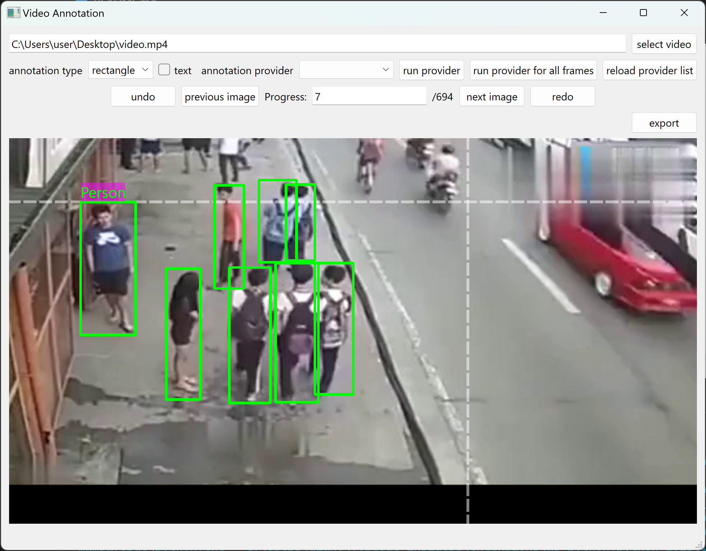

# Video and Image Annotation Tool

This is a Python project that provides a tool for annotating images and videos. The tool supports drawing rectangles, circles, points, and text annotations on the images and videos. The annotations can be saved to a JSON file and loaded back in later. The tool also supports exporting annotated videos and images.

## Installation

1. Clone this repository to your local machine.
2. Install the required dependencies by running `pip install -r requirements.txt`.

## Usage

1. Run the `main.py` file to open the annotation tool.
2. Select the video or image to annotate.
3. Draw annotations on the video or image.
4. Each drawing will save the annotation file.
5. Export the annotated video or image.

## Contributing

Contributions are welcome. Please follow these steps:

1. Clone this repository to your local machine.
2. Create a new branch: `git checkout -b my-feature-branch`.
3. Make changes.
4. Commit changes: `git commit -m "Add new feature"`.
5. Push changes: `git push origin my-feature-branch`.
6. Submit a pull request.
